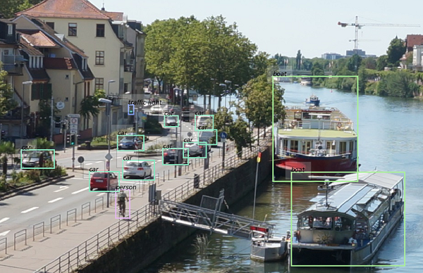

# YOLO_schwert
Schwert's experiment repo based on [Pytorch_YOLOv3](https://github.com/DeNA/PyTorch_YOLOv3)  
<b>Under Development! 
This repo will be modified without notice ;) </b>
<p align="left"></p>


## Development

#### top-priority:
- [ ] refactor yolo layer
- [ ] docstring 'em all
- [x] YOLOv3_PyTorch reproduction - training <- verified on 10k-iter training
- [x] decompose the YOLOv3 model into backbone / neck / head
- [x] detectron / mmdet - like repo structure
- [x] YOLOv3_PyTorch reproduction - inference
- [x] verify checkpoint / resume
- [x] evaluate script
- [x] demo script using predictor module
- [x] visualizer
- [x] all-gpu processing at yolo layer
- [x] tfboard output

#### new features:
- [ ] SPP
- [ ] transform modules
- [ ] mosaic loader
- [ ] albumentations
- [ ] scheduler test
- [ ] target assignment modules
- [ ] Backbone selection
- [ ] EfficientNet backbone
- [ ] cooler visualizer
- [ ] fvcore's history buffer
- [ ] warmupcosine scheduler
- [ ] multi-gpu training
- [ ] unittests

#### optional: 
- [ ] model registry
- [ ] hooks
- [ ] colorful logger


## Repository Structure
```
├── configs  # config files
├── data  # image data for readme
├── docker
├── requirements
├── tools  # train / demo / eval scripts
└── yolo_schwert
    ├── checkpoint  # checkpointer module and parsers
    ├── config  # default config definition
    ├── data  # dataset modules
    ├── engine  # trainer and predictor modules
    ├── evaluation  # evaluators
    ├── modeling  # model definitions (detectors -> backbone, neck, head)
    ├── solver  # solver modules incl. schedulers
    └── utils  # utility modules e.g. box processing
```


## Performance
#### Inference using yolov3.weights
reproduces original darknet repo.
<table><tbody>
<tr><th align="left" bgcolor=#f8f8f8> </th>     <td bgcolor=white> Original (darknet) </td><td bgcolor=white> Ours (pytorch) </td></tr>
<tr><th align="left" bgcolor=#f8f8f8> COCO AP[IoU=0.50:0.95], inference</th> <td bgcolor=white> 0.310 </td><td bgcolor=white> 0.311 </td></tr>
<tr><th align="left" bgcolor=#f8f8f8> COCO AP[IoU=0.50],      inference</th> <td bgcolor=white> 0.553 </td><td bgcolor=white> 0.558 </td></tr>
</table></tbody>

#### Training Benchmark

Coming soon...  

## Preparation
#### Docker Environment

We provide a Dockerfile to build an environment that meets the above requirements.

```bash
# build docker image
$ nvidia-docker build -t yoloschwert-image --build-arg UID=`id -u` -f docker/Dockerfile .
# create docker container and login bash
$ nvidia-docker run -it -v `pwd`:/work --name yoloschwert-container yoloschwert-image
docker@0123456abcde:/work$ python train.py --help
```

#### Download pretrained weights
download the pretrained file from the author's project page:   

```bash
$ mkdir weights
$ cd weights/
$ bash ../requirements/download_weights.sh
```

#### COCO 2017 dataset:
the COCO dataset is downloaded and unzipped by:   

```bash
$ bash requirements/getcoco.sh
```

## Inference and Training

##### Evaluate the official yolov3.weights and make sure inference goes fine
```bash
$ python tools/train.py --config configs/eval_original_yolov3_weights.yaml --opts TEST.INTERVAL 1 SOLVER.LR 0.
```
The result should be:
```
 Average Precision  (AP) @[ IoU=0.50:0.95 | area=   all | maxDets=100 ] = 0.311
 Average Precision  (AP) @[ IoU=0.50      | area=   all | maxDets=100 ] = 0.558
 Average Precision  (AP) @[ IoU=0.75      | area=   all | maxDets=100 ] = 0.313
 Average Precision  (AP) @[ IoU=0.50:0.95 | area= small | maxDets=100 ] = 0.141
 Average Precision  (AP) @[ IoU=0.50:0.95 | area=medium | maxDets=100 ] = 0.339
 Average Precision  (AP) @[ IoU=0.50:0.95 | area= large | maxDets=100 ] = 0.457
 Average Recall     (AR) @[ IoU=0.50:0.95 | area=   all | maxDets=  1 ] = 0.275
 Average Recall     (AR) @[ IoU=0.50:0.95 | area=   all | maxDets= 10 ] = 0.416
 Average Recall     (AR) @[ IoU=0.50:0.95 | area=   all | maxDets=100 ] = 0.437
 Average Recall     (AR) @[ IoU=0.50:0.95 | area= small | maxDets=100 ] = 0.238
 Average Recall     (AR) @[ IoU=0.50:0.95 | area=medium | maxDets=100 ] = 0.477
 Average Recall     (AR) @[ IoU=0.50:0.95 | area= large | maxDets=100 ] = 0.603
```

##### Test yolov3.weights on one image
```bash
$ python tools/demo.py --image data/heidelberg.jpg --detect_thresh 0.5 --opts MODEL.WEIGHTS weights/yolov3.weights TEST.IMGSIZE 1024
```

##### Train from the darknet weights
```bash
$ python tools/train.py --config configs/Base_YOLOv3.yaml 
```

## Reference

- YOLOv3: An Incremental Improvement, _Joseph Redmon, Ali Farhadi_  
 [[Paper]](https://pjreddie.com/media/files/papers/YOLOv3.pdf), [[Original Implementation]](https://github.com/pjreddie/darknet), [[Author's Project Page]](https://pjreddie.com/darknet/yolo/)  
- PyTorch_YOLOv3, _hirotomusiker_, [[Repo]](https://github.com/DeNA/PyTorch_YOLOv3), [[medium blog]](https://medium.com/@hirotoschwert/reproducing-training-performance-of-yolov3-in-pytorch-part-0-a792e15ac90d)
- PyTorch_Gaussian_YOLOv3, _motokimura_, [[Repo]](https://github.com/motokimura/PyTorch_Gaussian_YOLOv3)
- YOLOv4: Optimal Speed and Accuracy of Object Detection  
_Alexey Bochkovskiy, Chien-Yao Wang, Hong-Yuan Mark Liao_  
[[Paper]](https://arxiv.org/abs/2004.10934), [[Repo]](https://github.com/alexeyab/darknet)
- YOLOv5 [[Repo]](https://github.com/ultralytics/yolov5)
- fvcore [[Repo]](https://github.com/facebookresearch/fvcore)
- detectron 2 [[Repo]](https://github.com/facebookresearch/detectron2)
